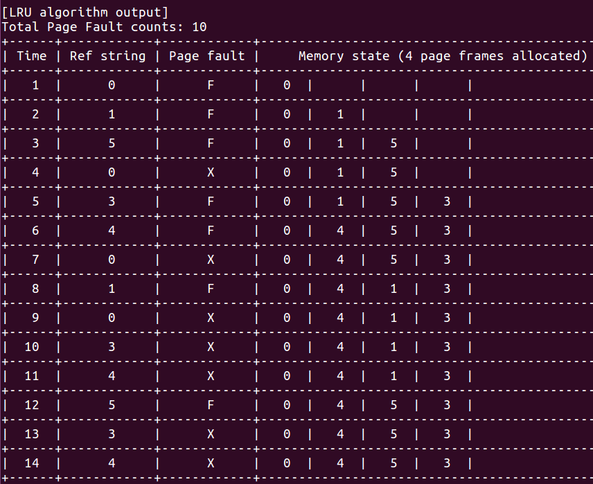
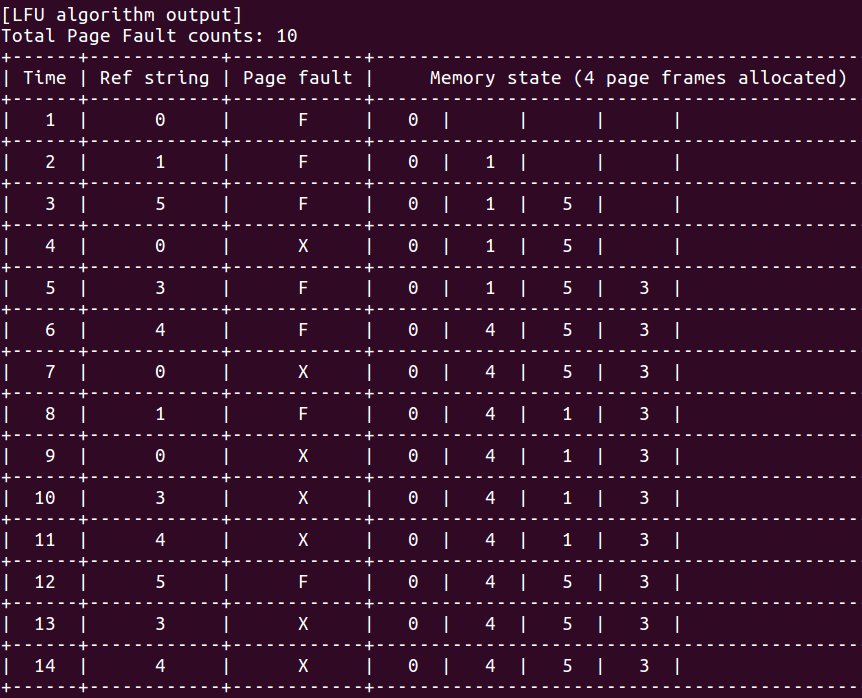
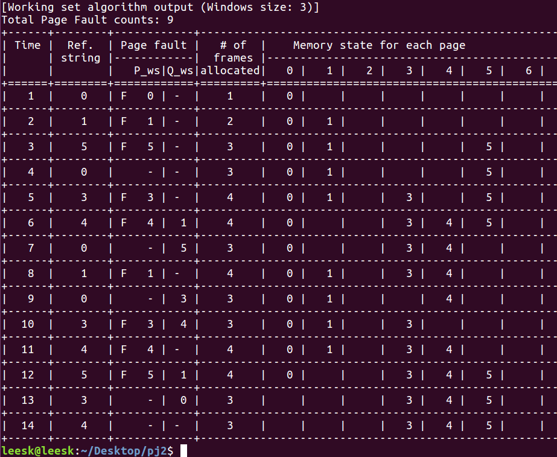
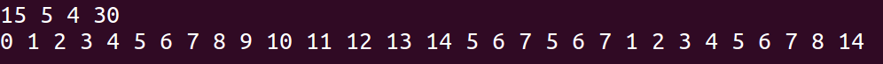
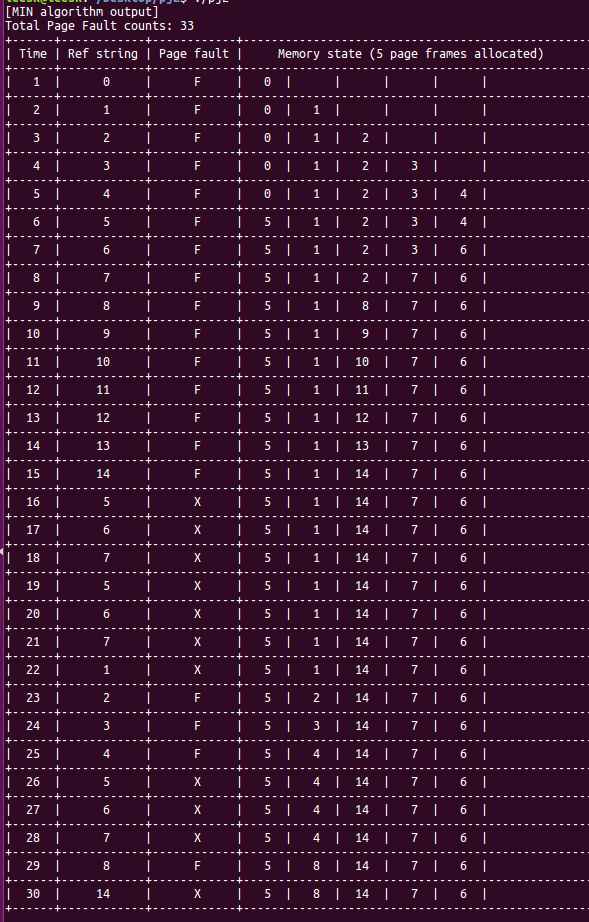
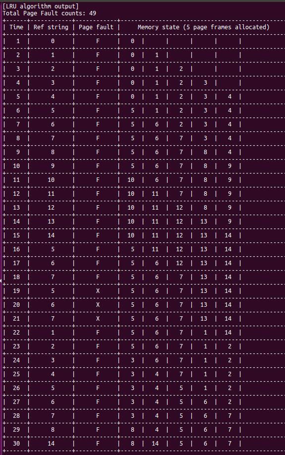
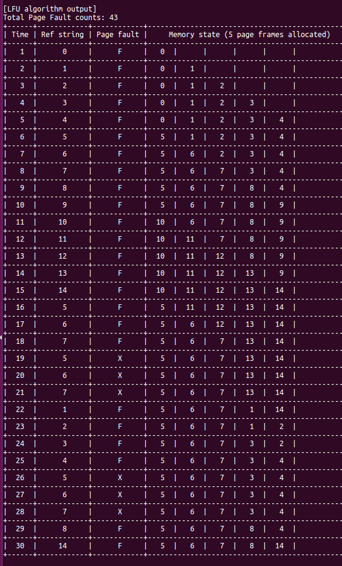
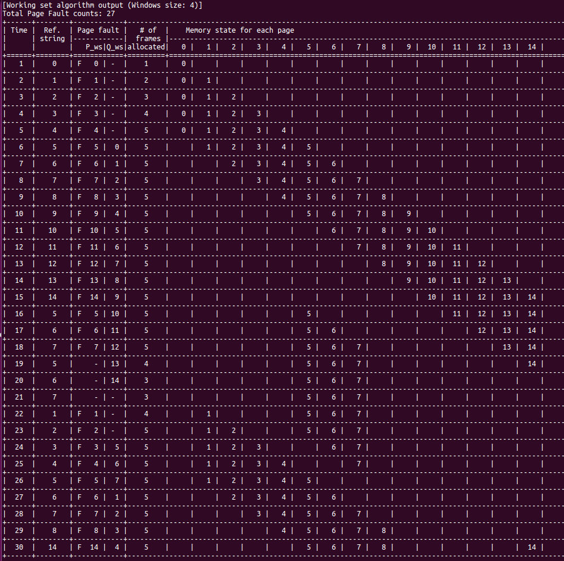

# Virtual memory mananagement
This is a repository for page replacement policy implementation for virtual memory management.

It supports following policies:
- MIN
- FIFO (First-In-First-Out)
- LRU (Least Recently Used)
- LFU (Least Frequently Used)
- WS (Working set memory management)

## Development environment
- Language: C
- IDE: VIM
- OS: Ubuntu 16.04.6 LTS
- Compiler: gcc 5.4.0

## Input
```
N M W K
r1  r2 … rk
```
Input file is ```inputvm.txt``` and the inputs are as follows:

- N: # of page of process (5<=N<=15, It starts from 0)
- M: # of page frames for fixed allocation policy
- W: Window size for working set memory management
- K: Length of page reference string
- r<sub>1</sub>  r<sub>2</sub> … r<sub>k</sub>: Page reference string


## Output
```
For each policy:
# of pafe fault
Memory residence set changing, Page fault page
```

## Screenshot - Case 1
### Input

### Output
### MIN


### LRU


### LFU


### Working set



## Screenshot - Case 2
### Input

### Output
### MIN


### LRU


### LFU


### Working set


<br></br>
## To be fixed
- [ ] Page fault counts not working
